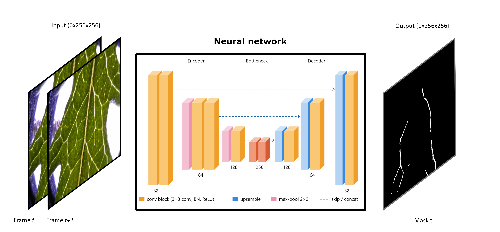
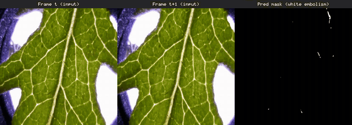

# Leaf embolism segmentation

## Authors: Lorenzo Mandelli, Kate M. Johnson, Maurizio Mencuccini, Stefano Berretti
#### CREAF, Università degli Studi di Firenze



 

Embolism — the formation of air bubbles in a plant's water-transport system — is a
mechanistic driver of plant death. The Optical Vulnerability Technique (OVT) is an
imaging method for the non-invasive quantification of embolism, including the commonly
used drought-vulnerability metric P50, providing detailed spatial and temporal
information; its major cost lies in the post-processing of thousands of images. Here we
design, train, test, and publicly release a neural-network model that automates the
post-processing of OVT images. Using a dataset of 65 leaves from *Senecio pterophorus*
plants dried to 100% embolism, we compare our model's predictions with results obtained
via traditional post-processing by an expert. The model resolved P50 to within 0.04 MPa
of the expert-processed data, demonstrating its promise for increasing the efficiency
and throughput of P50 calculation, although it did not perfectly replicate the pixels
constituting the embolism events (mean event-frame IoU of 0.38). **We do not propose
replacing the semi-automated (expert) pipeline; rather, we leverage expert-processed data
to train a neural network that greatly increases the efficiency and throughput of OVT
image processing**. We invite the community to use our model, and emphasise that care must
be taken when considering when and how to apply this and similar approaches to OVT data. 




---

## Installation

```bash
python -m venv .venv && source .venv/bin/activate
pip install -r requirements.txt
```

For a CUDA build of PyTorch, install `torch` following the
[official instructions](https://pytorch.org/get-started/locally/) first.

---

## Dataset

A **sample sequence** (one test-set leaf) is available on Hugging Face so you can
try the pipeline — the **full dataset will be released later**:
**[LorenzoMande/Leaf_embolism](https://huggingface.co/datasets/LorenzoMande/Leaf_embolism)**

```bash
pip install huggingface_hub
hf download LorenzoMande/Leaf_embolism --repo-type dataset --local-dir data_hf
mkdir -p data
for f in data_hf/*.tar.gz; do tar xzf "$f" -C data; done   # -> data/<sequence>/
```

Then run it:

```bash
python src/method/predict.py  --sequence Senecio_10_11_L3_Cavicam14_160725
python src/method/evaluate.py --sequence Senecio_10_11_L3_Cavicam14_160725
```

Each sequence is a folder of time-lapse `.png` frames plus an `analysedStack/`
folder of ground-truth mask `.tif`s (one per consecutive frame pair). Water-potential
metrics additionally use the metadata shipped with the full dataset.

---

## Repository structure

```
.
├── train.txt / val.txt / test.txt   # dataset splits (sequence names)
├── make_video.py                    # utility: PNG frames → video (ffmpeg)
├── requirements.txt
├── results/                         # curated result figures (see below)
├── data/                            # dataset — download from Hugging Face (see Dataset)
└── src/
    ├── check_data.py                # dataset integrity checker
    ├── make_splits.py               # regenerates train/val/test.txt
    └── method/
        ├── config.py                # all hyper-parameters and paths
        ├── model.py                 # U-Net (6-ch input, Focal + Dice loss)
        ├── losses.py                # Focal + Dice
        ├── dataset.py               # dataset + calibrated augmentation
        ├── train.py / predict.py / evaluate.py
        ├── run_method.sh           # full pipeline: train → predict → evaluate
        ├── checkpoints/             # trained weights (best_model.pt) + curves
        └── learning_curve/          # data-scaling experiment
```

Generated outputs (`outputs/`, `evaluation/`, `learning_curve/runs/`, …) are
`.gitignore`d — they are reproduced by running the pipeline.

---

## Usage

Run everything from the repository root. The pipeline has three stages, and
**training is optional** — a pre-trained checkpoint is already included at
[src/method/checkpoints/best_model.pt](src/method/checkpoints/best_model.pt).

| Stage | Script | Output |
|-------|--------|--------|
| **Train** | `train.py` | `checkpoints/best_model.pt` |
| **Predict** (inference) | `predict.py` | predicted masks in `outputs/` |
| **Evaluate** | `evaluate.py` | metrics + figures in `evaluation/` |

### A) Inference only — use the included pre-trained model

No training required:

```bash
python src/method/predict.py --all       # or a single one: --sequence <SEQUENCE_NAME>
python src/method/evaluate.py --all       # metrics + figures
```

### B) Train from scratch

Retrains the model (overwrites `checkpoints/best_model.pt`), then runs inference
and evaluation:

```bash
python src/method/train.py                # train (with early stopping)
python src/method/predict.py --all
python src/method/evaluate.py --all
```

Or the whole pipeline in a single command:

```bash
bash src/method/run_method.sh                    # extra flags are forwarded to train.py, e.g.:
bash src/method/run_method.sh --epochs 200 --batch-size 8
```

---

## Results

Curated figures in [results/](results/):

| File | Description |
|------|-------------|
| `summary_avg.txt` / `.csv` | Aggregate test-set metrics (IoU, Dice, F1, FP50) |
| `training_curves.png`, `loss_curve.png` | Training / validation loss |
| `learning_curve.png` (+ `.csv`) | Performance vs. training-set size |
| `cumulative_area_avg.png` | Predicted vs. GT cumulative embolised area |
| `discrete_fp50_avg.png`, `fp50_x_wp_avg.png` | Embolism-timing metrics |
| `examples/` | Qualitative GT vs. predicted masks |
